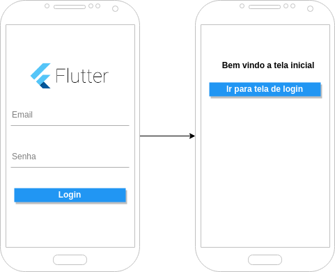

# Flutter pagina de login

Aplicativo de estudo do flutter.

Esta aplicação serviu de base para o estudo de rotas, formularios, internacionalização e estilização de componentes.

Abaixo um breve esboço da aplicação.

[DrawIo - flutter_login](https://drive.google.com/file/d/12Ni4xjKNEPF0HgxQssfKB165vgvVHQRv/view?usp=sharing)

### Material de referencia para o estudo:

#### Artigos:

Roteamento e formularios:

- [Barebones, página básica de login pt.1](https://blog.khophi.co/flutter-barebones-basic-good-looking-login-page-with-routing/)
- [Barebones, página básica de login pt.2](https://blog.khophi.co/flutter-barebones-basic-good-looking-login-page-with-routing-part-2/)
- [Barebones, página básica de login pt.3](https://blog.khophi.co/flutter-barebones-basic-good-looking-login-page-with-routing-part-3/)

Internacionalização:

- [Flutter: tutoriais de internacionalização: Parte 1](https://medium.com/@datvt9312/flutter-internationalization-tutorials-d8f0f711e7f)
- [Flutter: tutoriais de internacionalização: Parte 2](https://medium.com/@datvt9312/flutter-internationalization-tutorials-part-2-intl-package-approach-and-as-plugin-approach-b0aabdb254d8)
- [Flutter: tutoriais de internacionalização: Parte 3](https://medium.com/@datvt9312/flutter-internationalization-tutorials-part-3-android-studio-plugin-8604e2dc90f0)
- [Internacionalizando Aplicativos Flutter ( Site Oficial)](https://flutter.io/docs/development/accessibility-and-localization/internationalization)
- [Flutter - Localização: passo a passo](https://proandroiddev.com/flutter-localization-step-by-step-30f95d06018d)

Formularios:

- [Formularios no Flutter](https://medium.com/@anilcan/forms-in-flutter-6e1364eafdb5)
- [Flutter cookbook: Construindo um formulario com validação](https://flutter.io/docs/cookbook/forms/validation)
- [Flutter cookbook: Recuperando valor em um campo de texto](https://flutter.io/docs/cookbook/forms/retrieve-input)

Pacotes:
- [Validação do formulario: validate 1.7.0](https://pub.dartlang.org/packages/validate#-installing-tab-)
- [Internacionalização: intl 0.15.7](https://pub.dartlang.org/packages/intl)